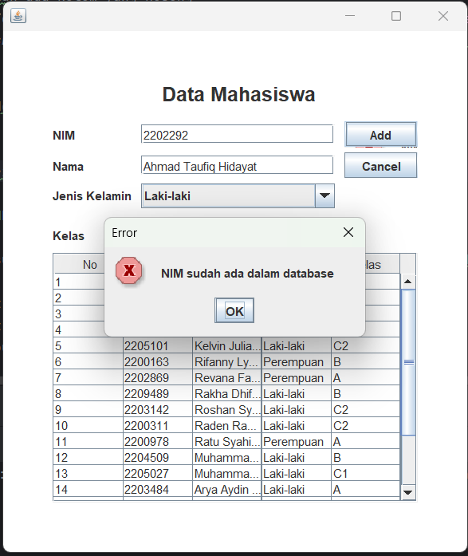

# TP 2 DPBO

## Janji

Saya Ahmad Taufiq Hidayat dengan NIM 2202074 mengerjakan TP 2
dalam mata kuliah DPBO untuk keberkahanNya maka saya tidak
melakukan kecurangan seperti yang telah dispesifikasikan. Aamiin.

## Data Diri

- 2202074
- Ahmad Taufiq Hidayat
- Ilmu Komputer C1'22
- Universitas Pendidikan Indonesia

## Detail Implementasi

Pada program ini merupakan implementasi Object Oriented Programming dengan menggunakan Java GUI Kit, program yang dibuat berisi form input data mahasiswa dengan atribut NIM, Nama, Jenis Kelamin, dan Kelas. program ini juga dapat menampilkan, mengubah, dan menghapus data yang telah disimpan. Dengan menghubungkan database menggunakan mysql

## Fitur

1. error message jika ada field yang kosong
2. field nim di disabled jika ingin melakukan update dan delete
3. melakukan pengecekan nim saat insert data agar tidak terjadi duplikasi nim
4. warning message jika ingin menghapus record data mahasiswa

## Screenshot

